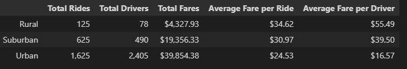
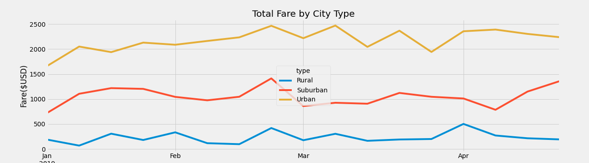

# PyBer Analysis

## Overview
The CEO of a ride-sharing company, Pyber, is interested in looking at ride-sharing data for her company by city type: rural, suburban, and urban. In this analysis, we will compare city types by summary ridership metrics for rides, drivers, and fares. 

### Purpose 
The purpose is to understand, at a high-level, the uptake of PyBer's ride-sharing services by city type. 

## Results
This analysis showed that PyBer usage is significantly higher in terms of total rides and number of drivers in urban areas for this evaluation period (January 2019-April 2019). Comparing total rides by city type, urban areas have 13 times the number of rides compared to rural areas and nearly 3 times the volume of rides compared to suburban areas. We also see that the number of drivers is substantially higher in urban areas; there are 30 times more urban drivers compared to rural and nearly 5 times the number of drivers compared to the suburbs. As would be expected given the comparably higher number of rides and drivers, the total fares collected during this period is higher for the urban areas, collecting 2 times more in total fares compared to suburban areas and more than 9 times that collected in rural areas.

In contrast, when this summary data is evaluated on a per ride and per driver basis, we see that rural per ride and per driver fares are the highest. Compared to urban fares, rural fares are about $10 more per ride or 1.4 times the cost whereas suburban fares are $6 more per ride, on average, or 1.1 times the cost. Likewise, the average fare per driver is substantially higher for rural drivers at more than 3 times the fare, on average, or nearly $40 more. Suburban drivers also earn higher fares compared to urban - approximately 3 times more and $23 more per ride, on average.

The table below summarizes the metrics described above by city type.

The graphic below visually shows the variance in total fares generated by city type.

## Summary
This summary data clearly shows disparate usage of PyBer ride-sharing services by city type. The data tell us that urban areas have significantly more drivers with more tota rides taken. However, we notice that per driver and per ride average fares are substantially more in rural areas. 

While this analysis is insightful, more data is required to draw conclusions and inform future business decisions. One key driver in total fares being higher in rural areas is likely the number of miles a driver takes a rider. Average mileage per ride would be important to incorporate to more completely compare city types by fares.

If fares are comparable per mile, the next question would be to understand whether the cost is a barrier to use in rural areas given the lower volume of rides and drivers. Is it simply an issue of smaller populations in these areas with more people having their own or is it that the cost per mile is too high given the longer distances required for travel in rural areas. This data would come from surveys of riders and non-riders, particularly in rural areas. If surveys are impractical, data could be extrapolated from car ownership per capita and average income for each city type. 

Another standout metric is that the total number of rides for urban areas is less than the total number of drivers. This means that there are more drivers than demand and as such, this drives the average fare per driver down. This raises the question around whether there is enough demand for these services in urban areas to support the drivers. More data is needed to understand this - it may be that some of these urban areas do not present significant barriers to individual driving such as low parking costs and ready parking options or perhaps, some of these urban areas have solid public transportation infrastructure alleviating the need for driving altogether. 
To investigate this, more sophisticated analysis should be considered to look at urban areas.
